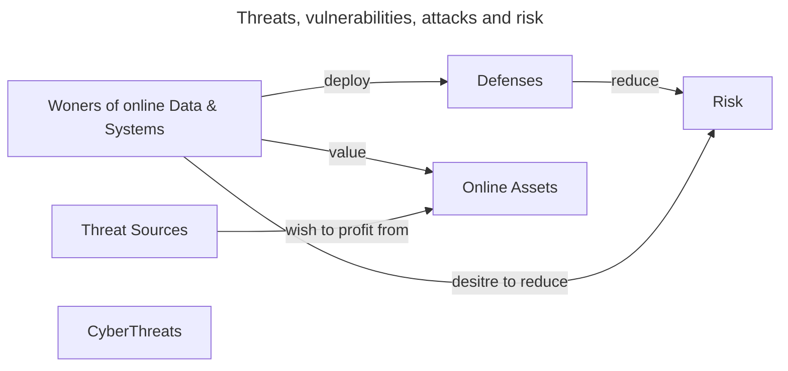

## Definition

Project something valuable from criminal activities.

## Threat source

* Cyber-criminals: want to profit from others' sensitive data.
* Hacktivists: don't like something you do or something you are.
* Nation-Sates: political advantage or for espionage.

## Vulnerabilities and attacks

* Threat actors exploit vulnerabilities to launch attacks.
* Attacks lead to compromise or security breaches
* Vulnerabilities in software, networks and humans.

## Real world attacks

2013 Target store breach.

Sony Pictures quize

