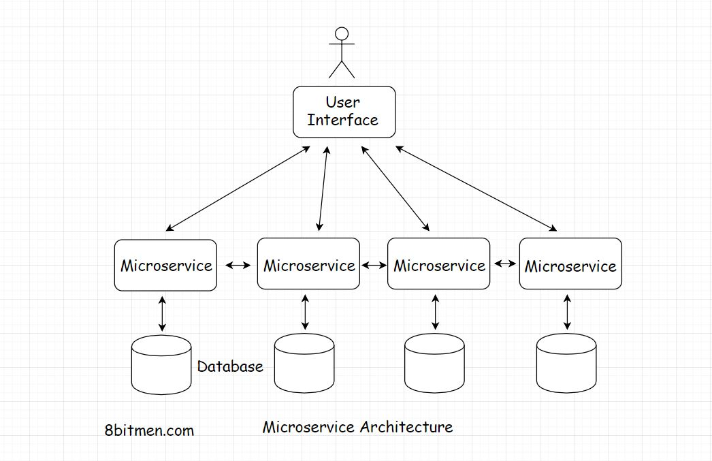

# High Availability

## Fault tolerance

*Fault tolerance* is the ability of the system to stay up despite taking hits.

### Failure reasons:

- Software crashes

- Hardware Failures

- Human errors [This is an interesting read](https://thenextweb.com/google/2017/08/28/google-japan-internet-blackout/).

- Planned Downtown: maintenance operations, software, hardware upgrade.

**Fail soft**:A few of the *instances/nodes*, out of several, running the service go offline & bounce back all the time. In case of these internal failures, the system could work at a reduced level but it will not go down entirely.

**Highly Available Fault-Tolerant Service.**

the entire massive service is architecturally broken down into smaller loosely coupled services called the **micro-services**

## Redundancy

### Active-Passive HA Mode

GPS, aircrafts, communication satellites which have zero downtime. The availability of these systems is ensured by making the components redundant.

### Single point failure: Distributed systems

### Monitoring & Automation - to cut down human errors

## Replication

### ***Active-Active High Availability***

### Geographical Distribution of Workload

## High Availability Clustering

A *High Availability cluster* also known as the *Fail-Over cluster* contains a set of nodes running in conjunction with each other that ensures high availability of the service. ***Heartbeat** network* monitors the health.

A single state across all the nodes in a cluster is achieved with the help of a shared distributed memory & a distributed co-ordination service like the ***Zookeeper***.

e.g. Jenkins master and clients.

*Disk mirroring/RAID Redundant Array Of Independent Disks*, redundant network connections, redundant electrical power

Which of the following statements is true in context to scalability & high availability?

Scaling an application horizontally means getting rid of single points of failure & that means the application also becomes highly available.
