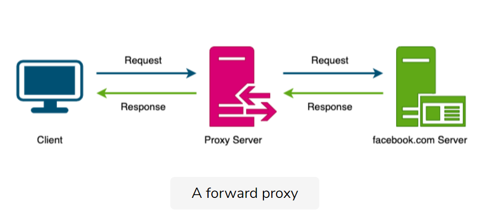
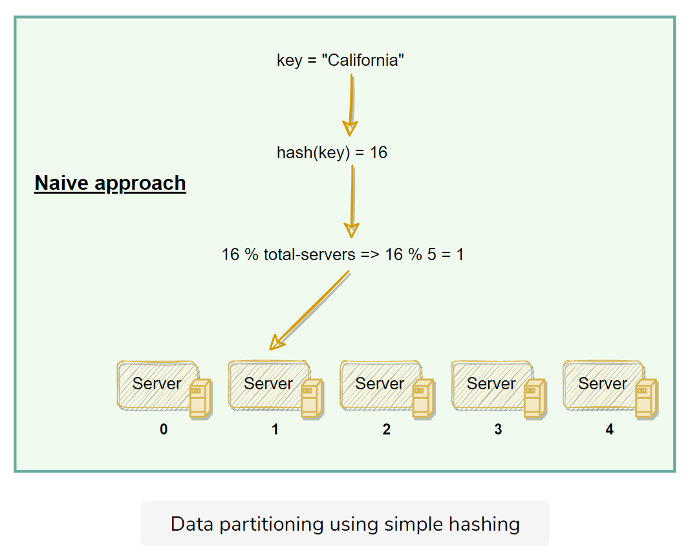
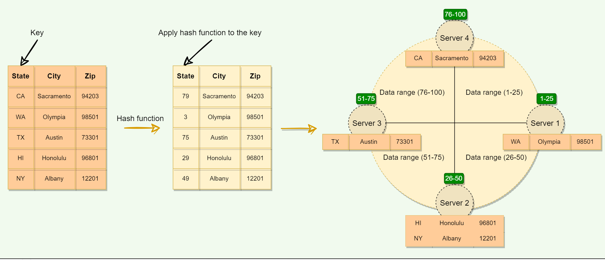
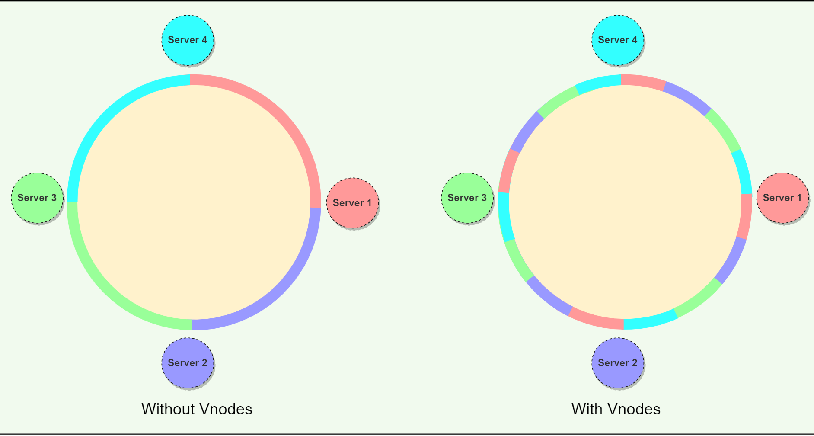
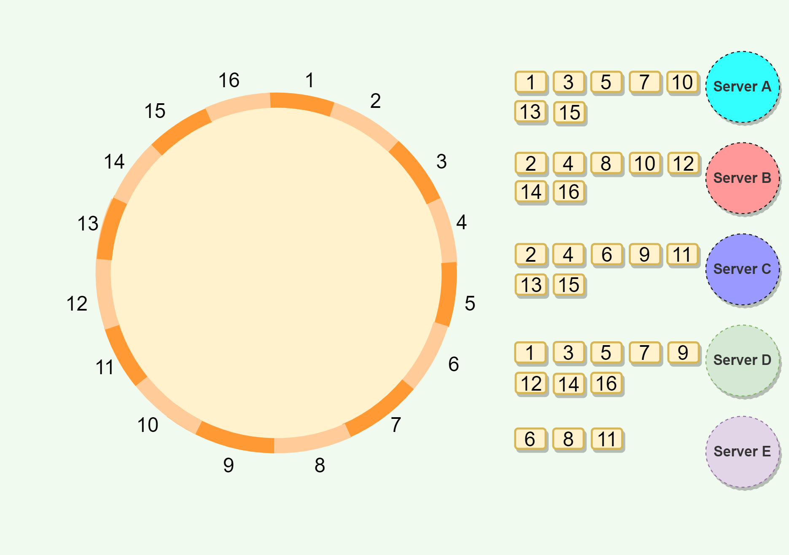
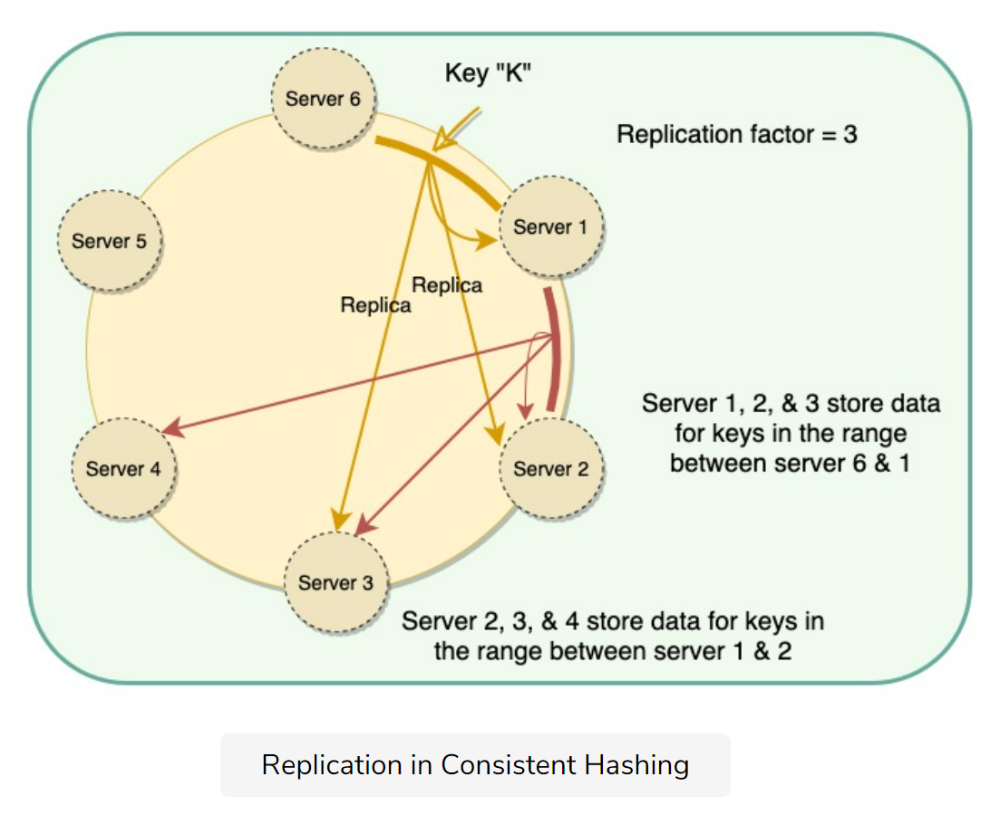

## Key Characteristics of Distributed Systems

### Scalability

**Definition**: The capability to grow and manage increased demand, such as increased data volume, number of transactions.

* Horizontal scaling:  [Cassandra](https://en.wikipedia.org/wiki/Apache_Cassandra) and [MongoDB](https://en.wikipedia.org/wiki/MongoDB)
* Vertical scaling: e.g. MySQL

### Reliability

**Definition**: The probability a system will fail in a given period.

### Availability

**Definition**: The time a system remains operational to perform its required function in a specific period.

### Efficiency

Definition:

The response time(latency) means the delay to obtain the first item.

The throughput(bandwidth) number of items delivered in a given time unit (e.g., a second)

### Manageability or Serviceability.

How easy it is to operate and maintain.

## Load Balancing(LB)

Between the user and the web server

Between web servers and an internal platform layer, like application servers or cache servers

Between internal platform layers and database.

### Redundant Load Balancers

## Caching

recently requested data is likely to be requested again

* Application server cache
* Content Delivery Network(CDN) for static media.
* Cache Invalidation
  * **Write-through **
  * **Write-around**
  * **Write-back**
* Cache eviction
  * First In First Out (FIFO)
  * Last In First Out (LIFO)
  * Least Recently Used (LRU)
  * Most Recently Used (MRU)
  * Least Frequently Used (LFU)
  * Random Replacement (RR)

## Data Partitioning

Definition: a technique to break a big database (DB) into many smaller parts

### Partition Methods

* Horizontal Partitioning. **(Data Sharding)** Different rows in different tables. Range-based partitioning. It may lead unbalanced servers.
* Vertical Partitioning. Store tables related to a specific feature in their own server.
* Directory-Based Partitioning: create a lookup service that knows your current partitioning scheme and abstracts it away from the DB access code

### Partitioning Criteria

* **Key or Hash-based Partitioning**: apply hash function to the entity's attribute, get partition number.
* List Partitioning: each partition has a list of values.
* **Round-robin partitioning**
* **Composite Partitioning**

### Common Problems of Data Partitioning

* **Joins and Denormalization**
* **Referential integrity**
* **Rebalancing**

## Indexes (DB)

Make it faster to search through the table, created one or more columns of a database table. 

### A Library catalog

Book name or book title sorted catalog

### It decreases write performance

Adding indexes is to improve search queries performances.

## Proxies

**Definition**: an intermediate piece of software or hardware sits between the client and the server.

### **Forward proxies**

* cache data
* filter requests
* log requests
* transform requests

* collapsed forwarding to combine the same data access requests into one request.

### Reverse proxy

Definition: the node retrieves resources from one or more servers on behalf of a client.

* caching
* load balancing
* anonymizing the servers
* routing requests to the appropriate servers

# Redundancy and Replication

[Redundancy](https://en.wikipedia.org/wiki/Redundancy_(engineering))  is the duplication of critical components or functions to increase system's reliability, a form of a backup or fail-safe or performance improving.

[Replication](https://en.wikipedia.org/wiki/Replication_(computing)) means sharing information to ensure consistency between redundant resources, to improve reliability, fault tolerance or accessibility.

Widely used in DBMS, usually primary-replica relationship.

## SQL vs NoSQL

### SQL

Store data in rows and columns in predefined tables.

### No-SQL

* **Key-Value Stores**: store data in key-value pairs. **Redis, Voldemort, and Dynamo**
* **Document DB**: store data in documents. **CouchDB and MongoDB**
* **Wide-Column Databases**: Instead of 'tables', column families which are containers of rows. Each rows doesn't have to have the same number of columns. Columnar databases are for large datasets. **Cassandra and HBase.**
* **Graph Databases** store data whose relationship are in a graph, store the data in nodes, properties, and lines. e.g. **Neo4J and InfiniteGraph.**

### Differences

|                     | SQL                       | No-SQL                                                    |
| ------------------- | ------------------------- | --------------------------------------------------------- |
| Storage             | tables                    | key-value, document, graph, or columnar                   |
| Schema              | Fixed schema              | dynamic, add in the fly                                   |
| **Querying**        | structured query language | UnQL (Unstructured Query Language)                        |
| **Scalability**     | Vertically                | horizontally                                              |
| **ACID Compliancy** | ACID compliant            | sacrifice ACID compliance for performance and scalability |

# Consistent Hashing (New)

**Data partitioning**

**Data replication**

A carefully designed scheme for partitioning and replicating the data **enhances the performance, availability, and reliability of the system** 

David Karger et al. first introduced Consistent Hashing in their [1997 paper](https://dl.acm.org/doi/10.1145/258533.258660) 

Consistent Hashing maps data to physical nodes and ensures that **only a small set of keys move when servers are added or removed.**

Each node is assigned one of these ranges. The start of the range is called a **token**.

However, the above scheme may  **result in non-uniform data and load distribution**. 

### Virtual nodes

Mapping Vnodes to physical nodes on a Consistent Hashing ring

Mapping Vnodes to physical nodes on a Consistent Hashing ring

Replication in Consistent Hashing

### Use cases

Amazon’s [Dynamo](https://www.allthingsdistributed.com/2007/10/amazons_dynamo.html) 

Apache [Cassandra](https://en.wikipedia.org/wiki/Apache_Cassandra)

## Long-Polling vs WebSockets vs Server-Sent Events

### Ajax Polling

The basic idea is that the client repeatedly polls (or requests) a server for data.

### HTTP Long-Polling

With Long-Polling, the client requests information from the server exactly as in normal polling, but with the expectation that the server may not respond immediately

### WebSockets

WebSocket provides [Full duplex](https://en.wikipedia.org/wiki/Duplex_(telecommunications)#Full_duplex) communication channels over a single TCP connection

### Server-Sent Events (SSEs)

Under SSEs the client establishes a persistent and long-term connection with the server.

cases: 

* Real-time traffic from the server to the client.
* the server is generating data in a loop and will be sending multiple events
