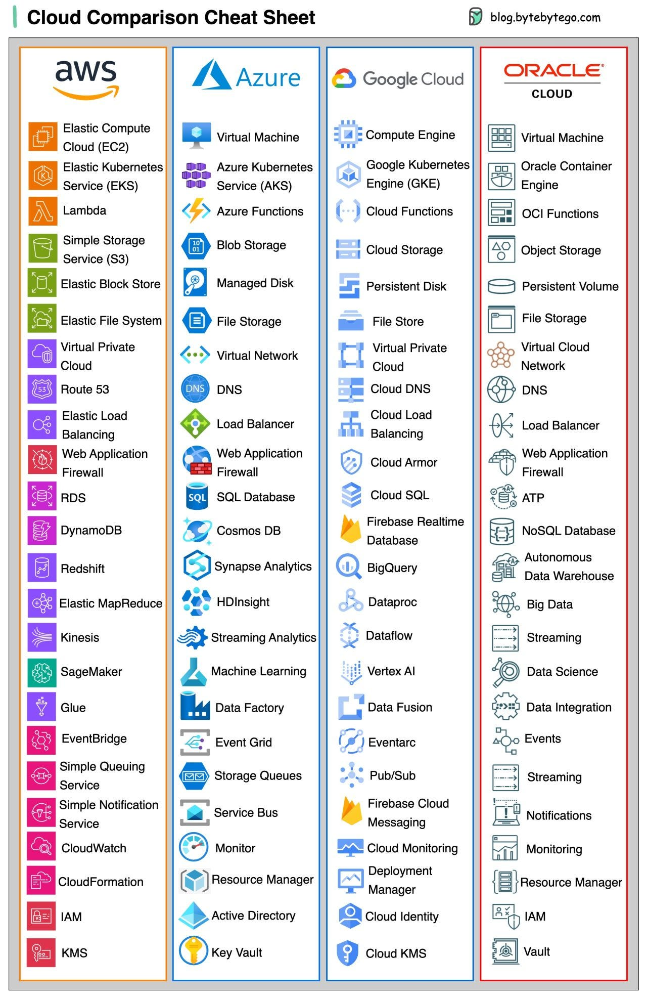

# Cloud Infra study

## [Google Cloud Platform (GCP)](https://en.wikipedia.org/wiki/Google_Cloud_Platform)

Launched on April 7, 2008 as App Engine.

## [AWS](https://en.wikipedia.org/wiki/Amazon_Web_Services)

Founded in July 2002, it has more than 200 products and services.

## [Azure](https://en.wikipedia.org/wiki/Microsoft_Azure)

"Azure was introduced as Professional Developers Conference (PDC) in October 2008. It was officially launched as Windows Azure in Feb, 2010, renamed into
Microsoft Azure on Mar.25, 2014."

My favorite functionaliites include Resource Group Concept and Working log
for each service.

## Comparison

[Amazon Maintains Lead in the Cloud Market](https://www.statista.com/chart/18819/worldwide-market-share-of-leading-cloud-infrastructure-service-providers/)

[Cloud Market Share: A Look at the Cloud Ecosystem](https://kinsta.com/blog/cloud-market-share/)

## References

[EP70: Cloud Services Cheat Sheet](https://blog.bytebytego.com/p/ep70-cloud-services-cheat-sheet)

## Public Cloud Cheat sheet

