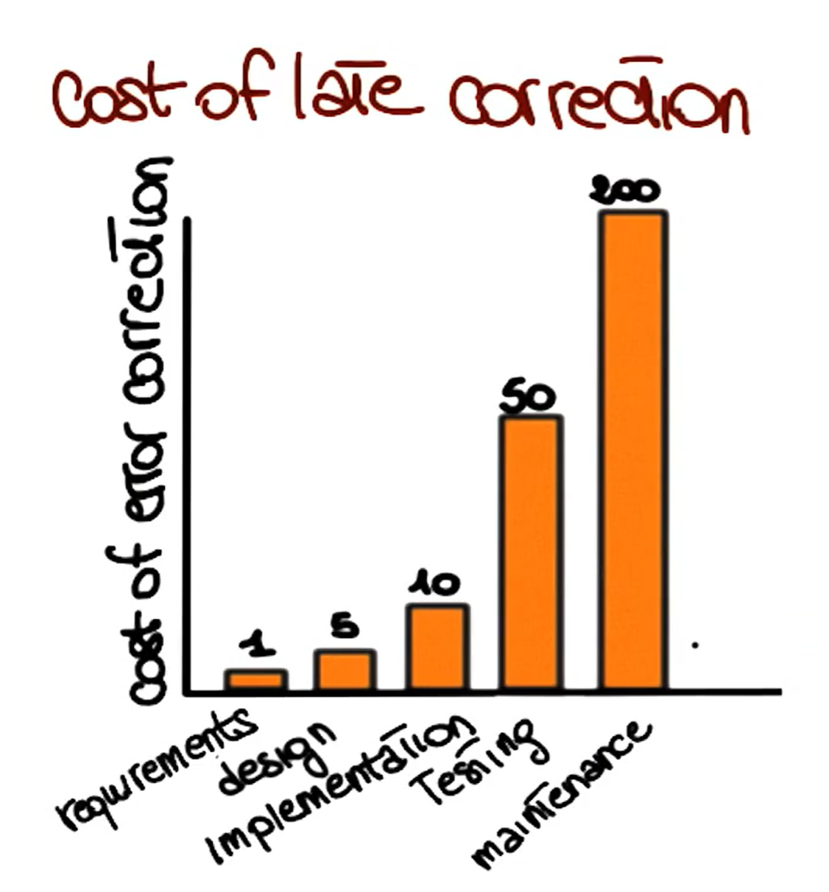

## Intro and Overview

The importance of Software Engineer(SE)

### The software crisis

* Rising demand for software
* Increasing software complexity
* Slow programmer's productivity growth

### Software process

* Waterfall
* Evolutionary prototyping
* RUP USP
* Agile

### Software Phases

* Requirements engineer
* Design
* Implementation
* Verification & Validation
* Maintenance

### Tools of the trade (software size and complexity)

* Development: Punch card to IDEs
* Language: Machine code -> High Level Languages
* Debugging: Print lines -> symbolic debuggers

#### Tools

* IDEs
* VCS (Git)
* Coverage and verification tools

## Life Cycle Models

* Waterfall
* Spiral
* *Rational Unified Process* (*RUP*) - UML
* Evolutionary prototyping
* Agile

### Barry Boehm Interview

* Technology
* People
* Product
* Process

Small projects - Agile

Larger projects - more rigorous approach

### Cost of late correction

### Requirements

* **Elicitation**: collecting requirements from customers and stakeholders
* **Analysis**: study and deep understanding of requirements
* **Specification**: pseudo-represented and documented
* **Validation**: verify the requirements are correct.
* **Management**

### Design to specification

1. Architecture design
2. Abstract specification
3. Interface design
4. component design
5. data structure
6. algorithm design

### Implementation

Four principles

* Reduction of complexity
* Anticipation of diversity
* Structure for validation
* Use of (external) standards.

### Verification & Validation

Validation: did we build the right system?

Verification: did we build the system right?

* Unit tests
* Integration
* System

### Maintenance

* Bug reports (**corrective** maintenance)

* Feature request (**perfective** maintenance)

* Environment change (**adaptive** maintenance)

* **Regression testing**

### Software process model

* Waterfall - 1956
* Spiral model - 1986
  * Specific expertise
  * complex
* Evolutionary prototype
  * Immediate feedback
  * Difficult to plan
* Rational Unified Process(RUP)
* Agile: TDD

### Lifecycle Documents

* IEEE document definition
* Light-Weight documents

### Classic Mistakes

* People:
  * Heroics
  * work environment
  * people management
* Process
  * scheduling issues
  * Planning issues
  * Failures
* Product
  * Gold plating
  * Feature creep
  * Research != Development
* Technology
  * Silver-bullet syndrome
  * Switching tools
  * No version control

## IDE

## Android
