# Neural Networks

Cell body -> Nevron -> Axon -> Synapses.

Perceptron

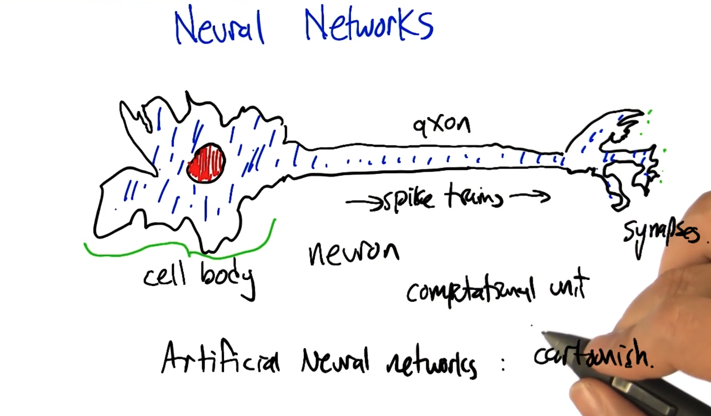

## Artificial Neural Networks

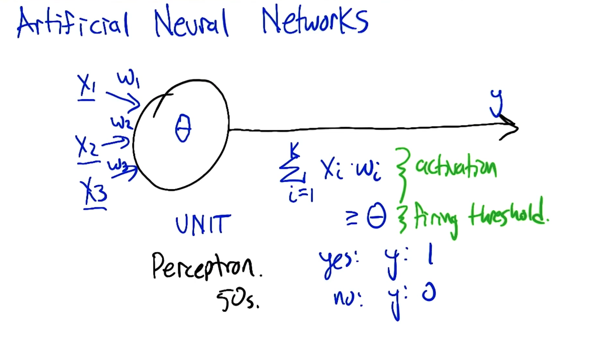

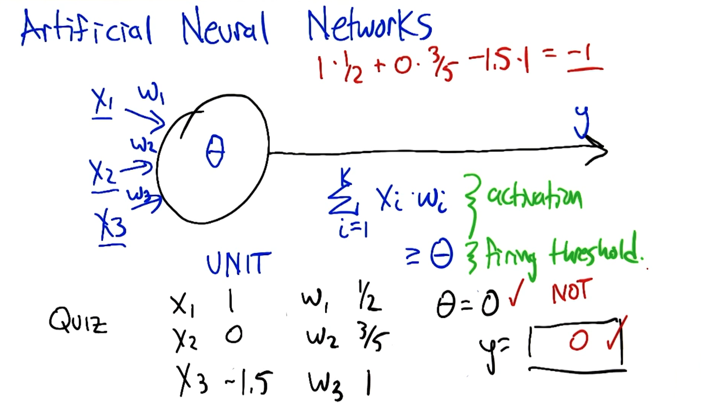

We need to pay attention to

* Activation function
* firing threshold

### How powerful is perceptron unit?

One activation function computes the half plane.

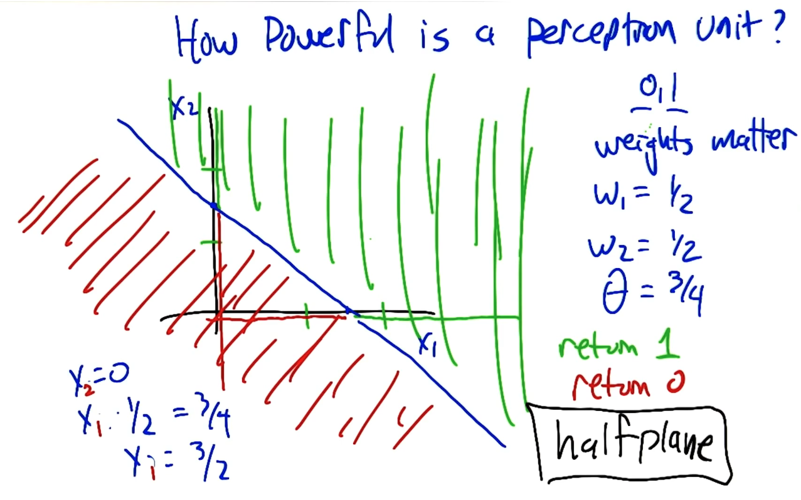

What's the nice and short computing in the following?

### Boolean: AND

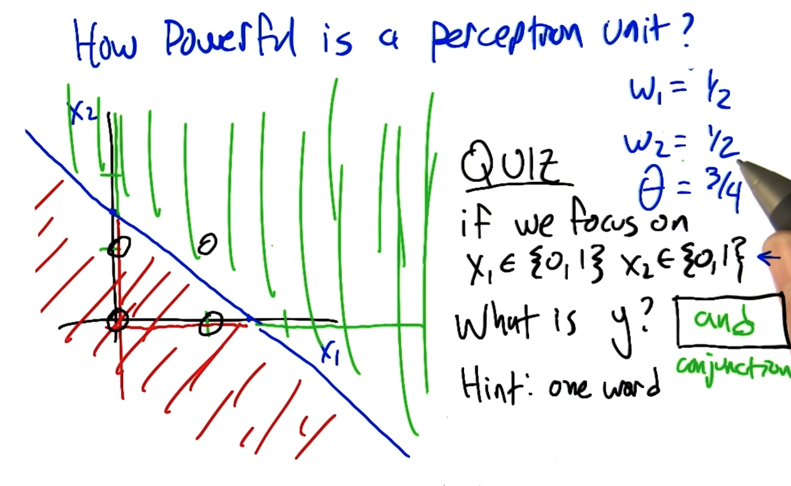

### Boolean: OR

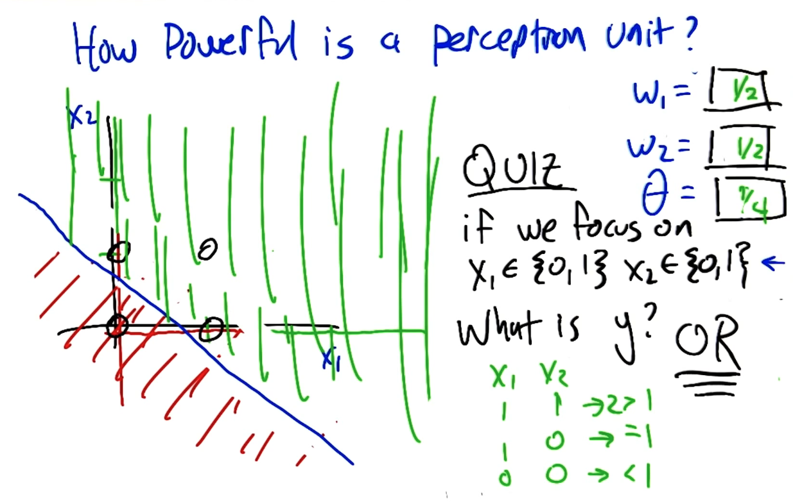

### Boolean: Not

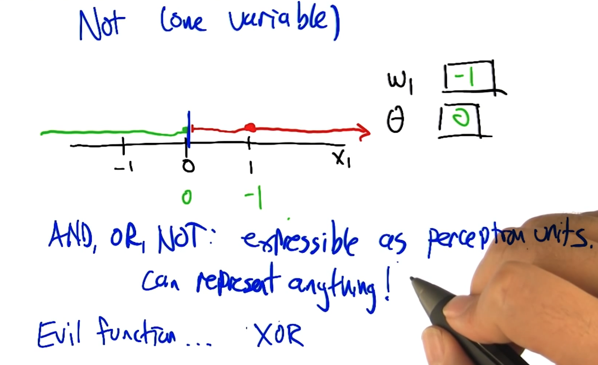

### XOR as Perceptron Network

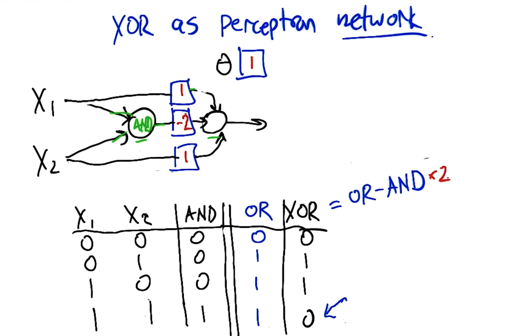

## Perceptron Training

Given examples, find weights that map inputs to outputs.

* Perceptron rule (**threshold**)
* Gradient descent / delta rule (**un-thresholded**)

### Perceptron rules

Single Unit

The halting problem for iterations.

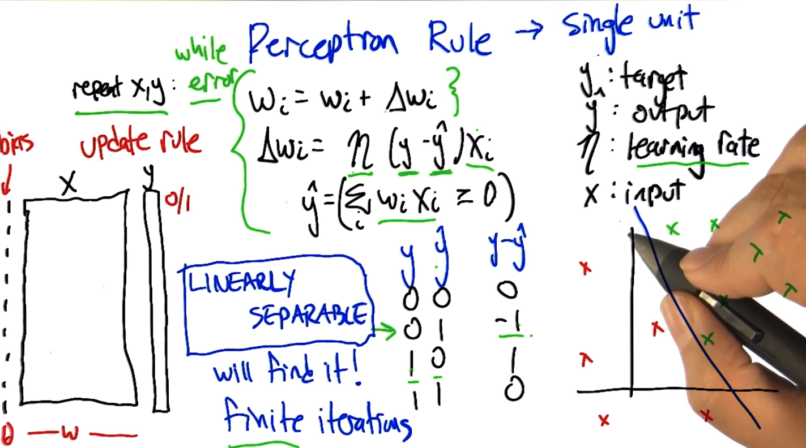

## Gradient Descent

Avoid Non-linear separability issues.

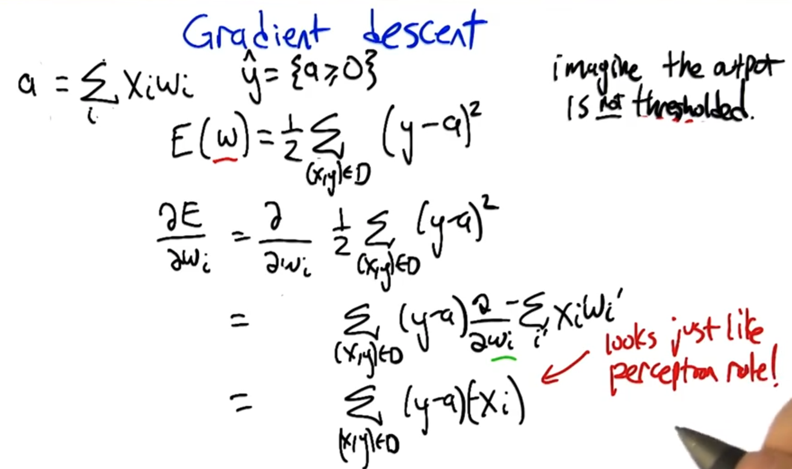

### Comparison of Learning rules

#### Perceptron analysis

guarantee to finite convergence only if linear separability
$$
\Delta W_i = \eta (y - y') x_i
$$
Eta = learning-rate

y = target

y' = output

#### Gradient Descent analysis

Calculus, robust, converge to local optimum

$$
\Delta W_i = \eta (y - a) x_i
$$

#### Comparing learning rules

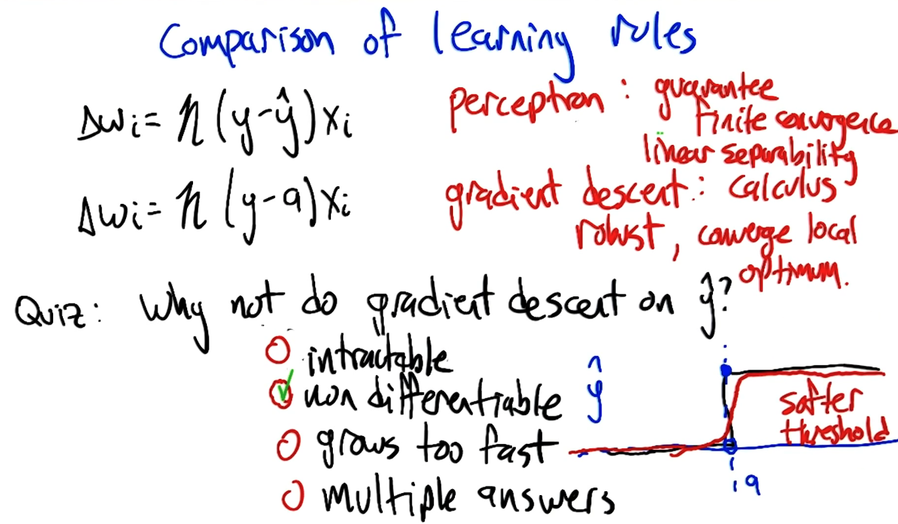

## Sigmoid - differentiable threshold

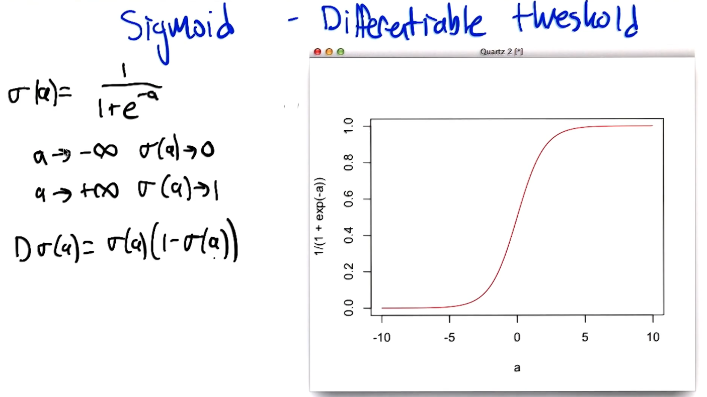

## Neural Network Sketch
