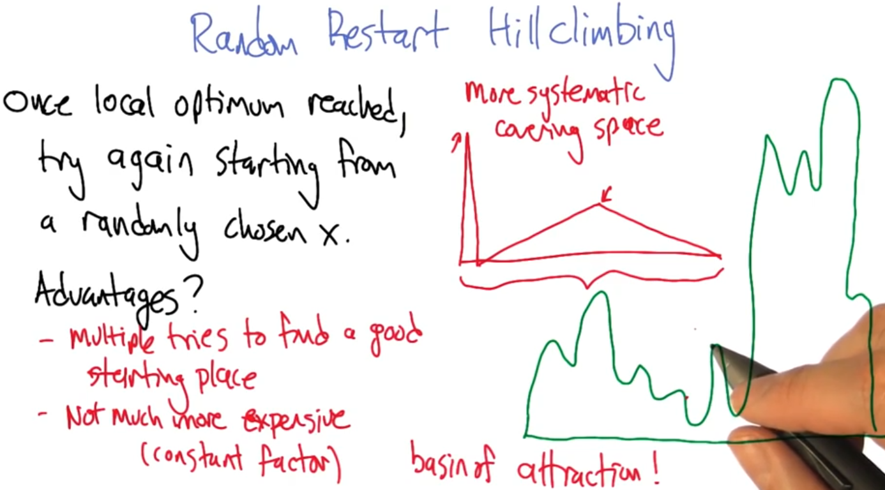

# Randomized optimization

Input space X

Objection function (fitness function) f: X->R

Goal: find
$$
x^* from X, f(x^*) = max f(x)
$$
Find the best.

* Rate finding
* Root finding
* Neural networks x is weights minimize error.

## Optimization approaches

Generate & Tests: small input spaces, complex function

Calculus: function has derivative

Newton's method: function has derivative, iterative improve -> single optimium

**what if assumption didn't hold?**

Big input space, complex function, no derivative ( hard to find), possibly many local optima.

## Hill climbing

## Simulated Annealing

Metropolis-Hastings

## Genetic algorithms

## Summary

Two problems:

1. These algorithms didn't remember information. How to capture history?

2. Simulated annealing uses Boltzmann distribution. How to capture probability distribution?

e.g.

* TABU search

## MIMIC

* Only points, no structure
* Unclear probability distribution.

Reference: **MIMIC: Finding Optima by estimating probability densities.**

* Directly model of probability distribution
* Successfully define model.

## A probability model

### MIMIC: a probability model
