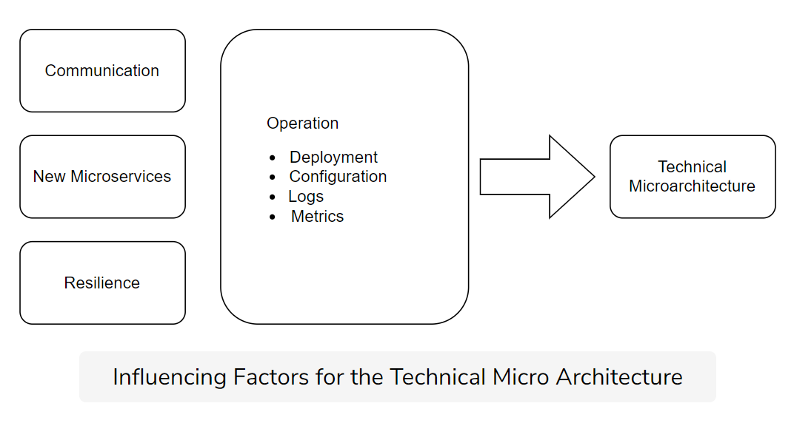
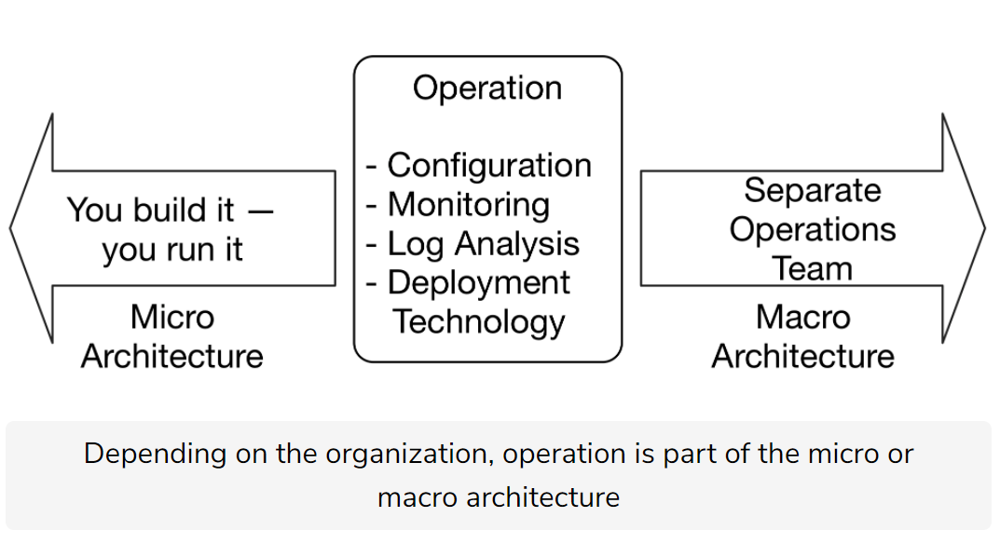

## **Definition**

Micro architecture: All decisions can be made individually for each microservice

Macro architecture: All decisions can be made at a global level and apply to all microservices.

## Topics

* Division of domain logic: **D                                                                                                                                                                                                                                                                                                               omain-Driven Design** and **Bounded context approaches**.
* How a DevOps model affects these decisions.
* Who divides the decisions into micro and macro architecture.

## Domain Driven Design & Bounded Contexts

**Domain-driven design (DDD)** offers a collection of **patterns** for the **domain model** of a system.

Books:

[DDD book](https://www.amazon.com/Domain-Driven-Design-Tackling-Complexity-Software/dp/0321125215)

[*Domain-driven Design Distilled*](https://www.amazon.com/Domain-Driven-Design-Distilled-Vaughn-Vernon/dp/0134434420)

[*Domain-Driven Design Reference*](https://domainlanguage.com/ddd/reference/)

[Microsoft Domain Analysis](https://docs.microsoft.com/en-us/azure/architecture/microservices/model/domain-analysis)

Domain-driven design speaks of a **bounded context**. Each domain model is valid only in a bounded context.

The simplest design consists of **multiple specialized domain models that are valid only in a certain context**.

**Domain events** between bounded contexts

### Strategic Design

Domain Model, Bounded Context

Up Steam to Down Steam

## customer/supplier pattern

## The conformist pattern

## The anti-corruption layer

## The separate ways pattern

## The shared kernel pattern

## The open host service pattern

## The published language model

## Selecting patterns

## Architecture Decisions

### Micro and Macro architecture decisions

#### Programming languages, frameworks, and infrastructure

* Micro: technology for the specific problems can be used.
* Macro: only developers knowledgeable in some technologies can be hired.

#### Database: backup strategy, recovery strategy

* Micro: Avoid global crash but higher effort to maintain
* Macro: Sharing DB contradict the bounded context. Even using a unified database, microservices need to have separate schemata in the DB.

#### UI

* Micro: different types of users with different requirements
* Macro: uniformed UI.

#### Documentation

* Micro: part of microservice handed over to another team
* Macro: Standardized documentation

### Typical Macro architecture decisions

* **communication protocol:** REST or messaging interface
* **Standardized data format**: JSON or XML.
* **Authentication**: Single authentication system. DC. Users **provide their identity.**
* **Integration**: run microservices together in the integration test.

### Typical micro architecture decisions

* Authorization: what a user is **allowed to do.** Vault?
* Testing: domain logic, non-functional requirements: performance critical or safety-critical.

|                      |                                        |                        |
| -------------------- | -------------------------------------- | ---------------------- |
| **Micro or Macro**   | **Micro Architecture**                 | **Macro Architecture** |
| Programming Language | Continuous Delivery Pipeline           | Communication Protocol |
| Database             | Authorization                          | Authentication         |
| Look and Feel        | Tests of the Microservice in Isolation | Integration Tests      |
| Documentation        |                                        |                        |

## Operation architecture

* **Configuration**: technical parameters or domain logic. Password or certificates in Vault.
* **Monitoring**: technology that tracks metrics / the state of the state. ELK
* **Log Analysis**: Datadog, splunk, sumu logic. A server to receive and manage logs.
* **Deployment Technology:**  How the microservice are rolled out. Docker, Kubernetes pods, PaaS or installation scripts.
* **Macro architecture operation with separate operations teams**
* **Standardize only technologies**
* Testing the operation macro architecture
* “You build it, you run it”: operation as micro architecture

## Give a Preference to Micro Architecture

### Macro architecture decisions: Best practices and advice

* Specifying only **a few points** in the macro architecture helps with focusing
* a macro architecture rule can ***define the monitoring technology***
* The macro architecture rules have to be **consequently enforced**.
* **independence** is an important goal of microservices

## Evolution of macro architecture

From restrictive rules into more languages and libraries.

## Organizational Aspects

* Uncontrolled growth
* Who defines macro architecture?
* Independent architecture committee
* How to enforce? **document reasons for each rule.**
* Black-bot testing conformance.

## Independent Systems Architecture Principles

**[ISA](http://isa-principles.org/) (Independent Systems Architecture)** is the term for a collection of fundamental principles for microservices.

## Conditions

**Should** describes principles which have many advantages but **do not have to be strictly followed**.

#### 1: The system must be divided into modules with interfaces

#### 2: Two separate levels of architectural decisions

#### 3: Modules must be separate processes/containers/VMs

#### 4: Standardized integration & communication: RESTFul or messaging

#### 5: Standardized metadata: token or track ID

#### 6: Independent continuous delivery pipelines

#### 7: Operations should be standardized

* configuration
* deployment
* log analysis
* tracing
* monitoring
* alarms

#### 8: Standardized interface

#### 9: Modules have to be resilient with Asynchronous communication

## Variations

**Identifying the right bounded contexts is a central challenge**
