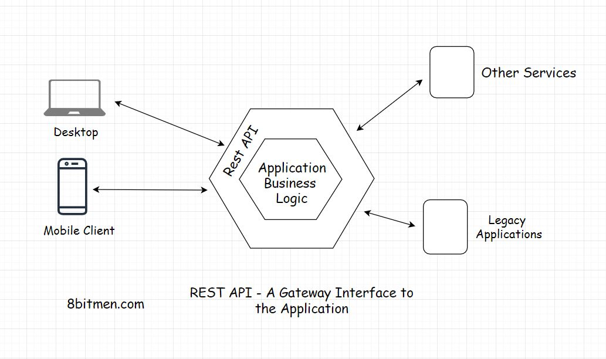
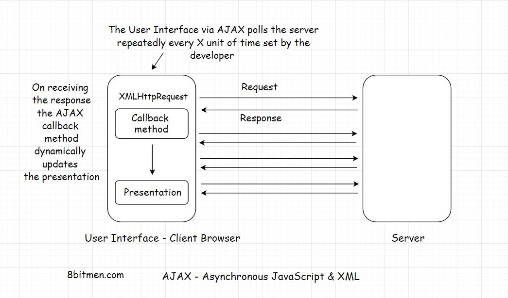

# Web app and architecture

[Web Application & Software Architecture](https://www.educative.io/module/lesson/web-application-architecture-101)

**Architectural styles:**

*client-server*, *peer to peer decentralized architecture*, *microservices*

## Overview

architects, developers and product owners study and discuss business
requirements (Requirement Gathering & Analysis).

Proof of Concept(POC)

## Software Tiers

Tiers are logical separation of components in an application or a service.
Not just code level, component level like database, UI, backend, message
caching.

- Single-Tier - UI, Backend business logic, DB in the same machine
  
  Pros: no latency, data safety
  Cons: The business cannot control after software releases.

- Two-Tier - Client with UI and business logic, backend server includes DB.
  
  Pros: UI, application logic & DB all in different machines.

- Three-Tier - Client with UI,
  

- N Tier > 3 components. Cache, Message queues for asynchronous behavior,
  load balancers. search server web microservice.

### Layers and Tiers

## What's web architecture

Multiple components like DB, message queue, cache,
UI runs together to form an online service.

## Client Server Architecture(request-response model)

Client: presentation part of the application, HTML, JS, CSS.

**open-source** technologies popular for writing the web-based user interface
are ReactJS, AngularJS, VueJS, Jquery

[StackOverflow popular technology](https://insights.stackoverflow.com/survey/2019#technology)

### Client

Thin client: just UI. No business logic. Just like a three-tier application.
Thick(Fat) client: holds some business logic. Two-tier applications.
Utility apps (docker registry), online games.

### Server

Web servers means application servers.

Other servers include proxy server, mail server, file server, virtual server.

#### Server side rendering

Render the UI on the backend and send it to the client.

## Communication

[HTTP protocol](https://developer.mozilla.org/en-US/docs/Web/HTTP/Overview)

Stateless protocol.

## REST API

REST stands for **Representational State Transfer**. It’s a software architectural
style for implementing web services. Web services implemented using the REST
architectural style are known as the RESTful Web services.

RESTful Web services allow the requesting systems to
**access and manipulate textual representations of Web resources**
by using a uniform and predefined set of stateless operations.

Stateless communication between client and server.

REST Endpoint: url of a service.

REST-API gateway.

## HTTP Push & Pull

Clients use ***AJAX (Asynchronous JavaScript & XML)*** to send
requests to the server in the HTTP Pull based mechanism.

There are multiple technologies involved in the
*HTTP Push* based mechanism such as:

- Ajax Long polling
- *Web Sockets*
- *HTML5 Event Source*
- *Message Queues*
- *Streaming over HTTP*

**AJAX uses an *XMLHttpRequest*(XHR) object for sending the requests**
to the server which is built-in the browser and uses JavaScript to update
the *HTML DOM*

**AJAX** is commonly used with the ***Jquery***

This dynamic technique of requesting information from the server after
regular intervals is known as ***Polling***.

**HTTP Pull-Push differences:**

**Persistent connection and heartbeat interceptors, which is resource intensive.**

Long opened connections can be implemented by multiple techniques such as
***Ajax Long Polling*, *Web Sockets*, *Server-Sent Events*** etc.

### Web sockets - bidirectional data flow

**messaging, chat applications, real-time social streams & browser-based massive
multiplayer games** which have quite a number of
read writes in comparison to a regular web app

[The WebSocket API](https://developer.mozilla.org/en-US/docs/Web/API/WebSockets_API)
&
[Introducing WebSockets – Bringing Sockets to the Web](https://www.html5rocks.com/en/tutorials/websockets/basics/)

### ***Long Polling***

lies somewhere between *Ajax* & *Web Sockets*. instead of immediately
returning the response, the server holds the response until it finds an
update to be sent to the client.

### HTML5 Event Source API & Server Sent Events(SSE)

[Server-sent events - Web APIs | MDN](https://developer.mozilla.org/en-US/docs/Web/API/Server-sent_events)

SSE is ideal for scenarios such as a real-time feed like that of
**Twitter, displaying stock quotes on the UI, real-time notifications etc**.

### *HTML5* & a *JavaScript Stream API*

[Streams API concepts - Web APIs](https://developer.mozilla.org/en-US/docs/Web/API/Streams_API/Concepts)

### Client-Side Vs Server-Side Rendering

We can use server-side rendering for the home page & for the other
static content on our website & use client-side rendering for the dynamic pages.
