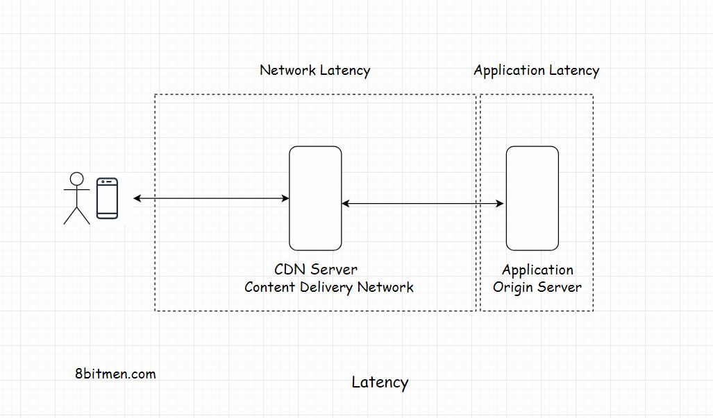

# Scalability

the ability of the application to handle & withstand increased workload without sacrificing the latency.

*Latency* is the amount of time a system takes to respond to a user request.

This latency is generally divided into two parts:

1. Network Latency - CDN to cut down.

1. Application Latency - stress & load tests and refactor the bottleneck.

   

## Type of scalatility

Vertical Scaling - hardware scale up.

Horizontal Scaling - server scale out.

### Cloud Elasticity

Scale up & down danamically.

### Scalability approach

No *static instances* in the class. Static instances hold application data & if a particular server goes down all the static data/state is lost.

Development teams today are adopting a distributed micro-services architecture right from the start & the workloads are meant to be deployed on the cloud. So, inherently the workloads are horizontally scaled out on the fly.

## Primary bottlenecks

- **application architecture:** *not using asynchronous processes & modules where ever required rather all the processes are scheduled sequentially.*

- Not using **caching** via several layers

- **Database:** database partitioning, sharding, use multiple database servers to make the module efficient.

- Having **Business logic in DB**

- Not **right DB**: transactions & strong consistency for Relational DB.  horizontal scalability on the fly pick a *NoSQL* database

- Code level: unnecessary loops, nested loops, tightly coupled code, Big-O complexity

## How to improve & Test scalability?

Performance tunning

- Profiling for concurrency errors, memory errors, robustness, safety

- Caching

- CDN

- Data compression

- Avoid unnecessary Client-Server requests.

### Testing the scalability

Different system parameters are taken into account such as the *CPU usage, network bandwidth consumption, throughput, the number of requests processed within a stipulated time, latency, memory usage of the program, end-user experience when the system is under heavy load* etc.

*JMeter* to load & stress tests.

[how production engineers support global events on Facebook.](https://engineering.fb.com/production-engineering/how-production-engineers-support-global-events-on-facebook/)

[how Hotstar a video streaming service scaled with over 10 million concurrent users](https://www.8bitmen.com/how-hotstar-scaled-with-10-3-million-concurrent-users-an-architectural-insight/)

*Cadvisor*, *Prometheus* and *Grafana* to tracking the system.

[read more about the pre-production monitoring.](https://www.8bitmen.com/what-is-grafana-why-use-it-everything-you-should-know-about-it/)
