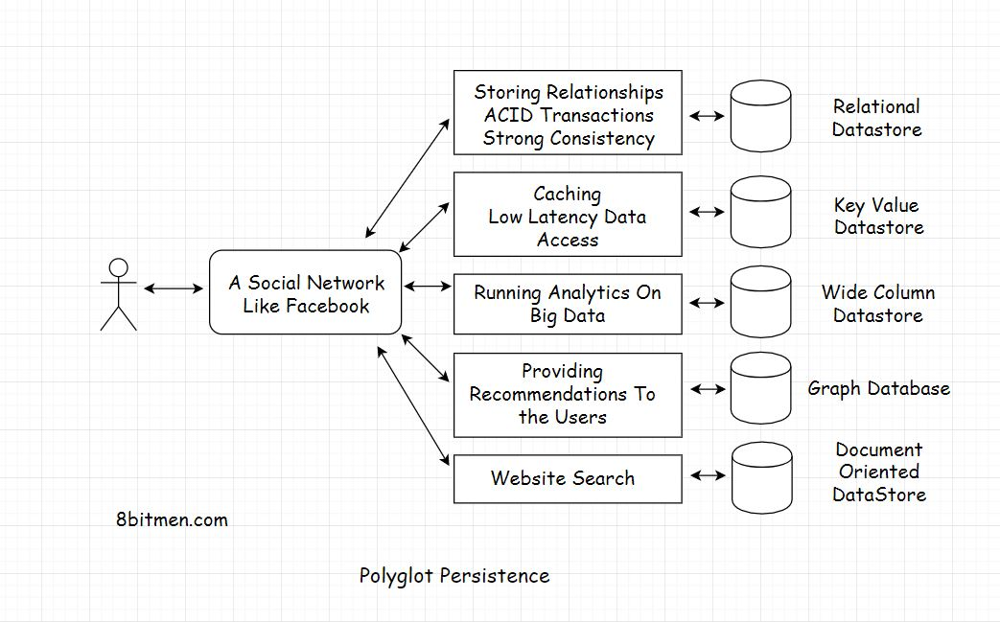

---
title: Database
date: 'January 30, 2022'
tags: ['System-Design']
--- 

## Date type

### Structured data - normalized fasion

normalized data means a unique entity occurs in only one place/table, in its simplest and atomic form and is not spread throughout the database.

### Unstractured Data

### User state

## Relational DB

### Transactions & Data Consistency

*ACID – Atomicity, Consistency, Isolation, Durability*.

### Storing Relationships

**Relational databases are built to store relationships.**

[Facebook as the main user-facing database.](https://www.8bitmen.com/what-database-does-facebook-use-a-1000-feet-deep-dive/)

*MySQL*,  *PostgreSQL*, *MariaDB*, *Amazon Aurora*, *Google Cloud SQL*

## NoSQL Databases

***JSON-based* databases** for  frequency read & writes, typically required in social applications like Twitter, LIVE real-time sports apps, online massive multi-player games etc.

### Why no-sql needed from relational DB?

### **Scalability**

Scaling SQL databases is something which is not trivial. They have to be *Sharded* or *Replicated* to make them run smoothly on a cluster

***NoSQL* databases** have the ability to add new server nodes on the fly & continue the work,

### Clustering

the server nodes even have *self-healing* capabilities.

## Features

### Pro

#### Gentle Learning Curve

#### Schemaless

### Cons

#### **Inconsistency**

#### No ACID

*MongoDB*, *Redis*, *Neo4J*, *Cassandra*,

*Google Cloud Datastore*

## When to use?

### Handling A Large Number Of Read Write Operations

Since they have the ability to add nodes on the fly, they can handle more concurrent traffic & big amount of data with minimal latency.

### Flexibility With Data Modeling

### Eventual Consistency Over Strong Consistency

### Running Data Analytics

**Database use cases**

*Time-Series databases*, \*

Wide-Column\* - *Cassandra* or *HBase*,

*Document Oriented* - *ElasticSearch*

Key-value store - *Redis or Memchache*

## Is NoSQL more performant?

*MongoDB*, *ExpressJS*, *AngularJS/ReactJS*, *NodeJs* pick NoSQL DB.

[Facebook uses MySQL for storing its social graph of millions of users.](https://www.8bitmen.com/what-database-does-facebook-use-a-1000-feet-deep-dive/)

[Quora uses MySQL by partitioning the data at the application level](https://www.quora.com/Why-does-Quora-use-MySQL-as-the-data-store-instead-of-NoSQLs-such-as-Cassandra-MongoDB-or-CouchDB-Are-they-doing-any-JOINs-over-MySQL-Are-there-plans-to-switch-to-another-DB)

### *Polyglot Persistence* to use both SQL and NoSQL

### **Facebook case study:**

## Multi-Model Databases

DB supports *Graph*, *Document-Oriented*, *Relational*

e.g.

***Arango DB*, *Cosmos DB*, *Orient DB*, *Couchbase***

## Eventual consistency

The upside of eventual consistency is that the system can add new nodes on the fly without the need to block any of them, the nodes are available to the end-users to make an update at all times.

## Strong consistency

Locking down the nodes needs to be updated.

**CAP theorem, queuing all the requests.**

**ACID Trasaction support in the geographic zone.**

NoSQL for Highly Available and Scalable.

## Consitency, Availability, Partition tolerance(CAP)

*CAP theorem* simply states that in case of a **network failure**, when a few of the nodes of the system are down, we have to make a choice between ***Availability* & *Consistency***

## Types of Databases

- ## Document-Oriented database

  - **Popular** *MongoDB, CouchDB, OrientDB, Google Cloud Datastore, Amazon Document DB*

  - Use cases

    - Real-time feeds
    - Live sports apps
    - Writing product catalogues
    - Inventory management
    - Storing user comments
    - Web-based multiplayer games

    [SEGA uses Mongo-DB to improve the experience for millions of mobile gamers](https://www.mongodb.com/blog/post/sega-hardlight-migrates-to-mongodb-atlas-simplify-ops-improve-experience-mobile-gamers)

    [Coinbase scaled from 15k requests per min to 1.2 million requests per minute with MongoDB](https://www.mongodb.com/customers/coinbase)

    **Search Engines**: [Elasticsearch](https://www.elastic.co/), [Splunk](https://www.splunk.com/), and [Solr](http://lucene.apache.org/solr/),

- ## Key-value datastore

  minimum latency to implement chaching.

  **Popular**. *Redis*, *Hazelcast*, *Riak*, *Voldemort* & *Memcache*.

  - - Caching
    - Persisting user state
    - Persisting user sessions
    - Managing real-time data
    - Implementing queues
    - Creating leaderboards in online games & web apps
    - Implementing a pub-sub system

    [Inovonics uses Redis to drive real-time analytics on millions of sensor data](https://redislabs.com/customers/inovonics/)

    [Microsoft uses Redis to handle the traffic spike on its platforms](https://redislabs.com/docs/microsoft-relies-redis-labs/)

    [Google Cloud uses Memcache to implement caching on their cloud platform](https://cloud.google.com/appengine/docs/standard/python/memcache/)

- ## Wide-column database

  primarily used to handle massive amounts of data, technically called the **Big Data**

  **analytical use cases**,  ensuring *scalability*, *performance* & *high availability* at the same time.

  *column-oriented* databases *wide-column* databases store data in a record with a dynamic number of columns. A record can hold **billions of columns**

  **Popular**: Cassandra\*, *HBase*, *Google BigTable*, *Scylla DB*

  [Netflix uses Cassandra as the backend database for the streaming service](https://medium.com/netflix-techblog/tagged/cassandra)

  [Adobe uses HBase for processing large amounts of data](https://hbase.apache.org/poweredbyhbase.html)

- ## Relational database

- ## Graph database

  **Features:**

  visualization

  Low latency: no need to join in SQL, just follow the edges.

  **e.g. Google Maps**

  **Popular** . Neo4J\*

  **Use cases: building social, knowledge, network graphs. Writing AI-based apps, recommendation engines, fraud analysis app, storing genetic data etc.**

  

  [Walmart shows product recommendations to its customers in real-time using Neo4J graph database](https://neo4j.com/case-studies/walmart/)

  [NASA uses Neo4J to store “lessons learned” data from their previous missions to educate the scientists & engineers.](https://neo4j.com/blog/david-meza-chief-knowledge-architect-nasa/)

- ## Time-Series database

  optimized for tracking & persisting time series data

  **Use cases:** data from IoT devices, self-driving vehicles, industry sensors, social networks, stock market financial data

  Writing an autonomous trading platform which deals with changing stock prices in real-time etc

  fetching data from IoT devices. Managing data for running analytics & monitoring

  **Primary usage**: running analytics, deducing conclusions and making future business decisions looking at the results of the analytics.

  **Popular** : Influx DB\*, *Timescale DB*, *Prometheus*

  [IBM uses Influx DB to run analytics for real-time cognitive fraud detection](https://www.influxdata.com/customer/ibm/)

  [Spiio uses Influx DB to remotely monitor vertical lining green walls & plant installations.](https://www.influxdata.com/customer/customer_case_study_spiio/)

- ## Databases dedicated to mobile apps

[Five of the Most Popular Databases for Mobile Apps - Trigent Vantage](https://blog.trigent.com/five-of-the-most-popular-databases-for-mobile-apps/)

[The Types of Modern Databases | Alooma](https://www.alooma.com/blog/types-of-modern-databases)
