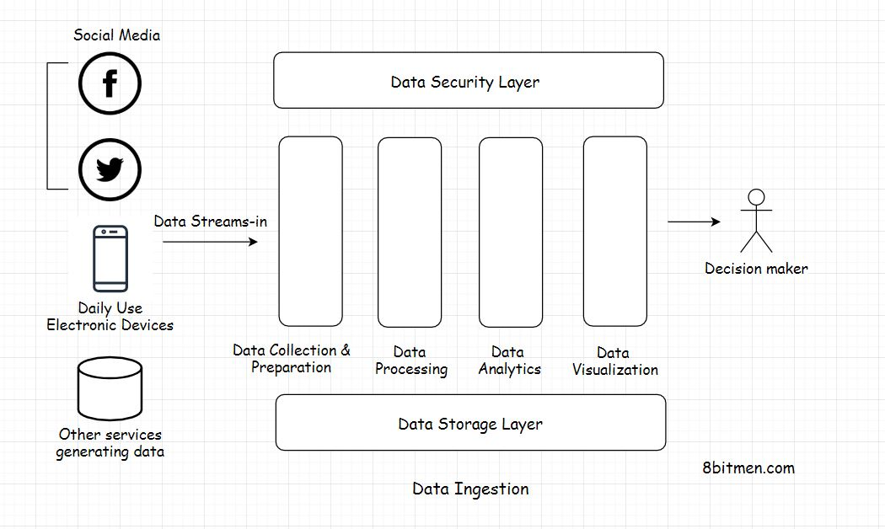
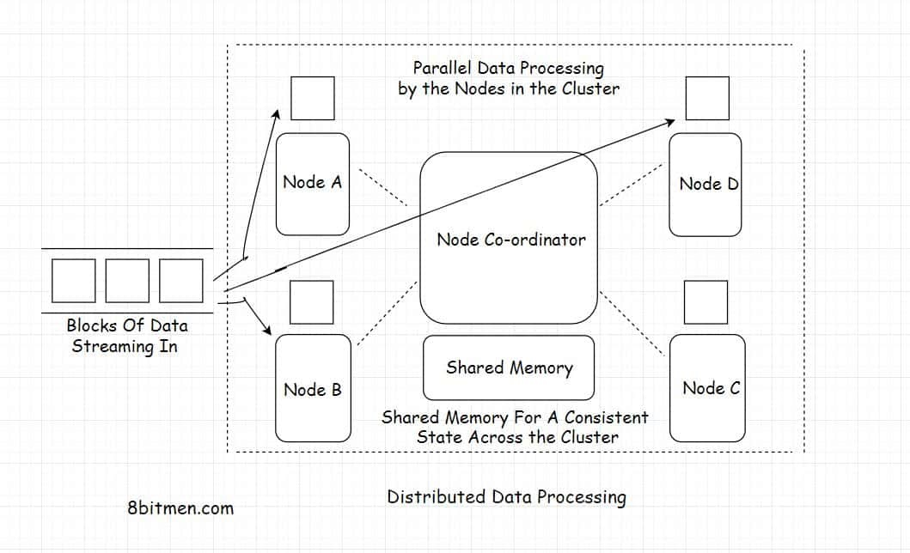
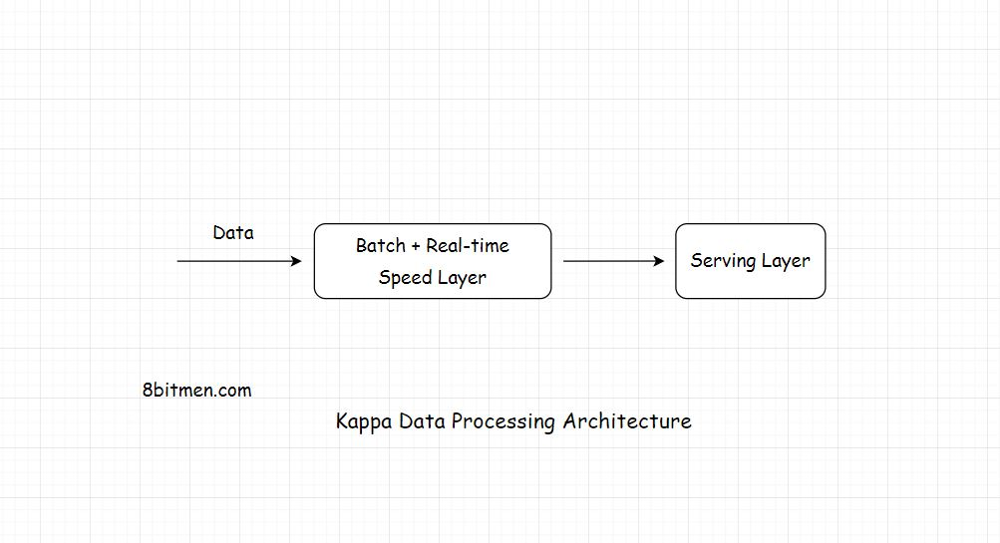

# Steam Processing

## Data Ingestion

***Data Ingestion*** is a collective term for the process of collecting data
streaming-in from several different sources and making it ready to be processed by the system.

### Layers of Data Processing Setup

#### (CPP+VSS)

- Data collection layer (**Data standardization**)
- Data preparation layer
- Data processing layer
- Data Analysis
  - analytics models such as predictive modelling, statistical analytics, text analytics etc.
- Data visualization layer
  - **Kibana**
- Data storage layer
- Data security layer

### **Ways of ingestion:**

***Real-time* :**

systems reading medical data like a heartbeat, blood pressure via
 wearable IoT sensors where the time is of critical importance;

financial data like stock market events etc.

***Batches***:

estimating the popularity of a sport in a region over a period of time.

### Challenges

Conversion of data is tedious

**analytics information obtained from real-time processing** is
not that accurate & holistic since the analytics continually runs
 on a limited set of data as it streams as opposed to the batch
 processing approach which takes into account the entire data set.

*Lambda* and the *Kappa* architectures of data processing

*Gobblin* is a data ingestion tool by LinkedIn.

At one point in time, LinkedIn had 15 data ingestion pipelines
running which created several data management challenges.

[To tackle this problem, LinkedIn wrote Gobblin in-house.](https://engineering.linkedin.com/data-ingestion/gobblin-big-data-ease)

[Gobblin Enters Apache Incubation | LinkedIn Engineering](https://engineering.linkedin.com/blog/2018/01/gobblin-enters-apache-incubation)

## Use cases

### Moving Big Data Into Hadoop

Big Data from IoT devices, social apps, treams through data
pipelines, moves into the most popular distributed data processing
 framework Hadoop for analysis & stuff.

[15 IoT Big Data Examples You Should Know | Built In](https://builtin.com/big-data/iot-big-data-analytics-examples)

### Streaming Data from Databases to Elasticsearch Server

Java, String Boot & Elastic Search.

### Log Processing

And logs are the only way to move back in time, track errors & study the behaviour of the system.

**Ingest logs to a central server:** ELK Elastic LogStash Kibana stack

### Stream Processing Engines for Real-Time Events

Message queues like *Kafka*, Stream computation frameworks like
*Apache Storm, Apache Nifi, Apache Spark, Samza, Kinesis* etc are
used to implement the real-time large-scale data processing features in online applications.

[Netflix’s real-time streaming platform](https://medium.com/netflix-techblog/keystone-real-time-stream-processing-platform-a3ee651812a)

## Data pipelines

***Data pipeline*** facilitate the efficient flow of data from one
 point to another & also enable the developers to apply filters on
  the data streaming-in in real-time.

### Features

- These ensure smooth flow of data.
- Enables the business to apply filters and business logic on streaming data.
- Avert any bottlenecks & redundancy in the data flow.
- Facilitate parallel processing of data.
- Avoid data being corrupted.

The entire flow of data extraction, transformation, combination,
 validation, converging of data from multiple streams into one
 etc. is completely automated.

#### **Extract Transform Load.(ETL)**

**Extract**&#160;means fetching data from single or multiple data sources.

**Transform**&#160;means transforming the&#160;*extracted*&#160;
heterogeneous data into a standardized format based on the rules
set by the business.

**Load**&#160;means moving the&#160;*transformed*&#160;data to a
data warehouse or another data storage location for further
processing of data.

**ETL flow is done in batches, not real-time.**

*Apache Flink*, *Storm*, *Spark*, *Kafka*

[Migrating Batch ETL to Stream Processing: A Netflix Case Study with Kafka and Flink](https://www.infoq.com/articles/netflix-migrating-stream-processing/)

## Distributed Data Processing

*Distributed data processing* means diverging large amounts of
data to several different nodes, running in a cluster, for
parallel processing.

***Apache Zookeeper*** is a pretty popular, de-facto, node co-ordinator used in the industry.

Since the nodes are distributed and the tasks are executed
parallelly, this makes the entire set-up pretty **scalable &
highly available**. The workload can be scaled both horizontally
& vertically. Data is made **redundant & replicated** across the
cluster to avoid any sort of data loss.

## Distributed Data Processing Technologies

### MapReduce – Apache Hadoop

*MapReduce*&#160;is a programming model written for managing
distributed data processing across several different machines
in a cluster, distributing tasks to several machines, running
work in parallel, managing all the communication and data transfer
 within different parts of the system.

The&#160;***Map***&#160;part of the programming model involves
sorting the data based on a parameter and the&#160;***Reduce***&

## 160;part involves summarizing the sorted data

The most popular open-source implementation of the&#160;*MapReduce programming
model*&#160;is&#160;*Apache Hadoop*. The framework is used by all big guns in the
 industry to manage massive amounts of data in their system. It is used by
 Twitter for running analytics. It is used by Facebook for storing big data.

### Apache Spark

***Apache Spark***&#160;is an open-source cluster computing framework. It
provides high performance for both batch & real-time in-stream processing. It can
work with diverse data sources & facilitates parallel execution of work in a cluster.

Spark has a cluster manager and distributed data storage. The cluster manager
facilitates communication between different nodes running together in a cluster
 whereas the distributed storage facilitates storage of big data. Spark
 seamlessly integrates with distributed data stores like&#160;***Cassandra, HDFS,
  MapReduce File System, Amazon S3***&#160;etc.

### Apache Storm&#160;[\#](https://www.educative.io/module/lesson/web-application-architecture-101/JPvpm3L54lK#apache-storm)

***Apache Storm***&#160;is a distributed stream processing framework. In the
industry, it is primarily used for processing massive amounts of **streaming
data**. It has several different use cases such as real-time analytics, machine
learning, distributed remote procedure calls etc.

### Apache Kafka&#160;[\#](https://www.educative.io/module/lesson/web-application-architecture-101/JPvpm3L54lK#apache-kafka)

***Apache Kafka***&#160;is an open-source distributed **stream processing &
messaging platform**. It’s written using&#160;*Java*&#160;&&#160;*Scala*&#160;&
was developed by&#160;*LinkedIn*.

The storage layer of Kafka involves a **distributed scalable pub/sub message
queue**. It helps read & write streams of data like a messaging system.

**Kafka** is used in the industry to develop **real-time features such as
notification platforms, managing streams of massive amounts of data, monitoring
website activity & metrics, messaging, log aggregation**.

***Hadoop***&#160;is preferred for&#160;***batch processing***&#160;of data
whereas&#160;***Spark, Kafka*&#160;&&#160;*Storm*** are preferred for processing
**real-time streaming** data.

## Lambda Architecture

*Batch processing* does take **time considering the massive amount of data
businesses** have today but with it the accuracy of the approach is high & the
results are comprehensive.

*real-time streaming data processing* provides quick access to **insights**

### Typically three layers

- Batch Layer - deals with the results acquired via batch processing the data
- Speed Layer - gets data from the real-time streaming data processing
- Serving layer - combines the results obtained from both the *Batch* & the *Speed* layers

## Kappa Architecture

In Kappa architecture, **all the data flows through a single data streaming pipeline**
as opposed to the Lambda architecture which has different data streaming layers that converge into one.

### Two Layers

- *Speed* - streaming processing layer

- *Serving*

*Kappa* is preferred if the **batch and the streaming analytics results are fairly identical**
in a system. *Lambda* is preferred if they are not.

## Limitations

1. a distributed system does not promise *Strong Consistency* of data.

1. Not trivial to set up and manage a distributed data processing system, years of work.
